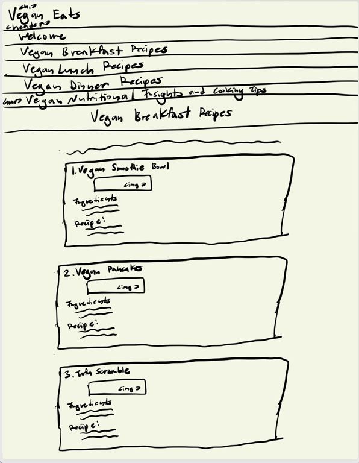
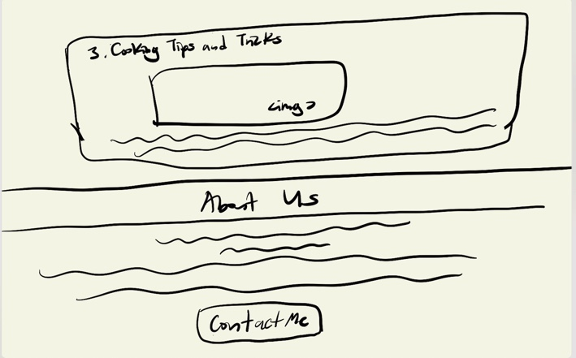
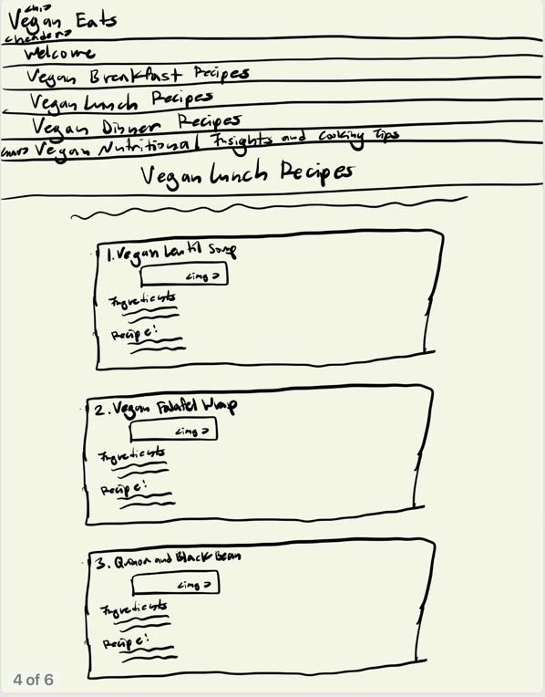
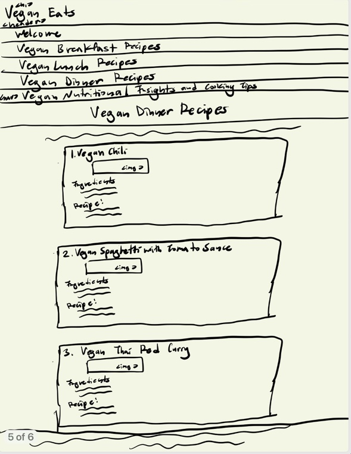
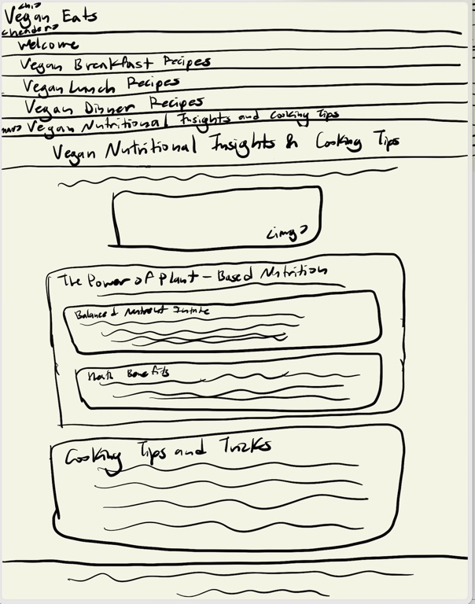

# Project 1, Milestone 1: Design Journey

[← Table of Contents](design-journey.md)

**Replace ALL _TODOs_ with your work.** (There should be no TODOs in the final submission.)

Be clear and concise in your writing. Bullets points are encouraged.

Place all design journey images inside the "design-plan" folder and then link them in Markdown so that they are visible in Markdown Preview.

**Everything, including images, must be visible in _Markdown: Open Preview_.** If it's not visible in the Markdown preview, then we can't grade it. We also can't give you partial credit either. **Please make sure your design journey should is easy to read for the grader;** in Markdown preview the question _and_ answer should have a blank line between them.

## Existing Design

**Make the case for your decisions using concepts from class, as well as other design principles, theories, examples, and cases from outside of class (includes the design prerequisite for this course).**

You can use bullet points and lists, or full paragraphs, or a combo, whichever is appropriate. The writing should be solid draft quality.

### Existing Site: The Site
> What is your existing site about? Tell us about it. (1 sentence)

The existing site is a platform dedicated to vegan cuisine and lifestyle, offering a diverse range of vegan recipes, nutritional insights, and cooking tips to cater to individuals who are already vegans or those exploring a vegan lifestyle.

> How and where did you create this site? (1 sentence)

The site was created using HTML and CSS for the front end, using Javascript to add minimal interactivity; there is a focus on responsive design, and it was developed locally on my computer in Ithaca using Github.

> Is this site designed for desktop, mobile devices or both? (1 sentence)

This site is designed for both desktop and mobile devices as it is responsive.

> Explain why this website is a **static** website. (1 sentence)

This website is a static website because its content remains unchanged unless manually updated by a developer and the site presents fixed content and displays the same pre-built information to all users, unlike dynamic websites that can generate content on-the-fly based on user interactions or data from a database.

### Existing Site: Audience
> Briefly explain your site's audience.
> Be specific and justify why this audience is a **cohesive** group. (1-2 sentences)

The target audience for my website consists of individuals fascinated by vegan cuisine and its lifestyle, encompassing both current vegans and those contemplating the adoption of a vegan way of life, and it caters to people simply intrigued by exploring and indulging in plant-based meals, forming a cohesive community united by shared principles and beliefs related to veganism, such as dietary choices, ethical and environmental considerations, health and well-being, community engagement, and lifestyle advocacy. This shared foundation fosters a robust sense of camaraderie and understanding among the audience, creating a strong and interconnected community.

### Existing Site: Audience Goals
> Document your existing site's audience's goals. (These should be informed by user research. Not assumptions or stereotypes.)
> List each goal below. There is no specific number of goals required for this, but you need enough to do the job (Hint: It's more than 1 and probably more than 2).

Goal 1: Recipe Exploration: Visitors are encouraged to explore the website for a wealth of new and captivating vegan recipes, providing inspiration for creating diverse and delicious plant-based meals in their own kitchens.

Goal 2: Nutritional Insight: Some users may be drawn to the website for insights into the health aspects of veganism. They can find valuable information about the nutritional advantages of a plant-based diet, including guidance on meeting essential nutrient requirements.

Goal 3: Culinary Assistance: The website acts as a valuable resource for individuals seeking guidance on cooking within the realm of vegan cuisine. Users can enhance their culinary skills, discover key vegan ingredients, and uncover time-saving cooking tips and tricks.

### Existing Site: Design/Sketches
> Sketch each page of your existing site.
> **You may not copy your sketches from a previous assignment.**
> Why can't you copy the sketches? I want to get you thinking about the strengths/weaknesses of your current design.
> Provide a **1 sentence** description _underneath_ each sketch that describes the page.

This homepage welcomes the user with a rainbow of vegetables and includes an introduction and an overview of what the website and the rest of the pages offer; there is also a footnote with a quote "about us", including a contacts modal and there is also a hamburger menu.

This page gives three detailed vegan breakfast recipes, presented in a colorful green/yellow themed matter with appetizing pictures of the food; there is a hamburger menu.

This page gives three detailed vegan lunch recipes, presented in a colorful green/yellow themed matter with appetizing pictures of the food; there is a hamburger menu and mirrors the previous page to show consistency.

This page gives three detailed vegan dinner recipes, presented in a colorful green/yellow themed matter with appetizing pictures of the food; there is a hamburger menu and mirrors the previous two pages to show consistency yet there is a footnote with a quote to introduce a change to pique the user's interest.

This page has a picture of a man shopping for aesthetic pleasure and gives nutritional insights on the vegan diet such as what consists a balanced nutrient intake and the health benefits of a vegan diet; there are also cooking tips and tricks and another footnote with a quote.

Identify header nav and image
[← Table of Contents](design-journey.md)
