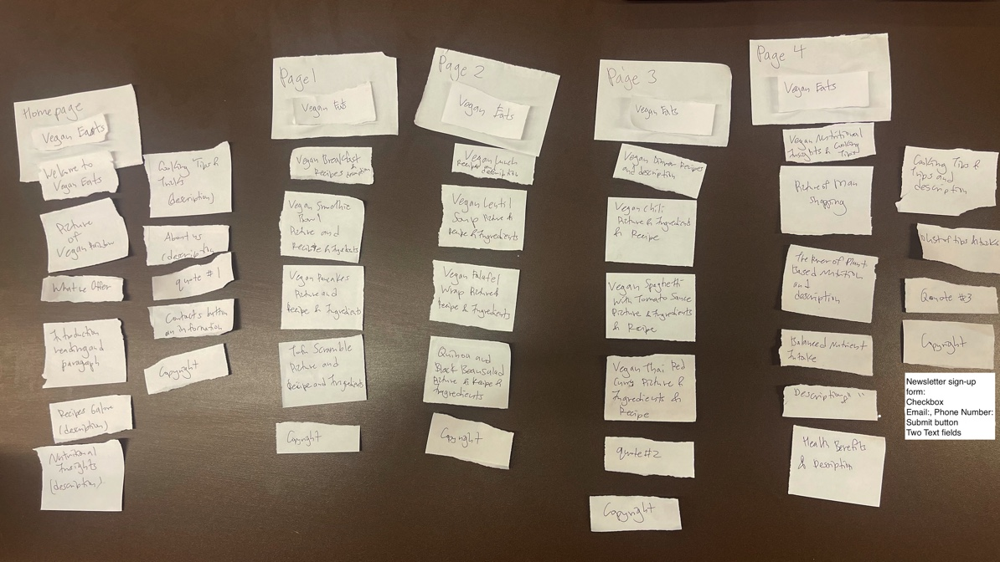
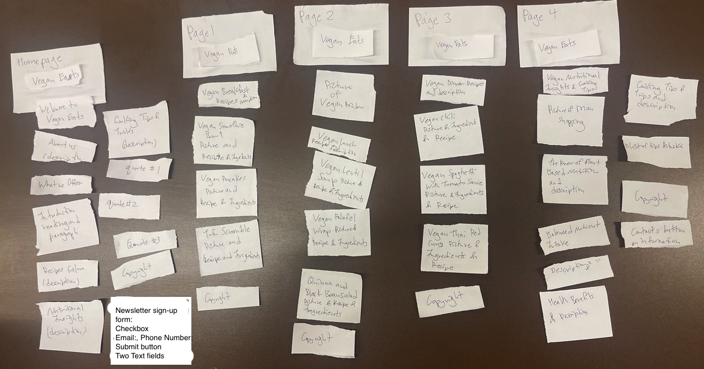
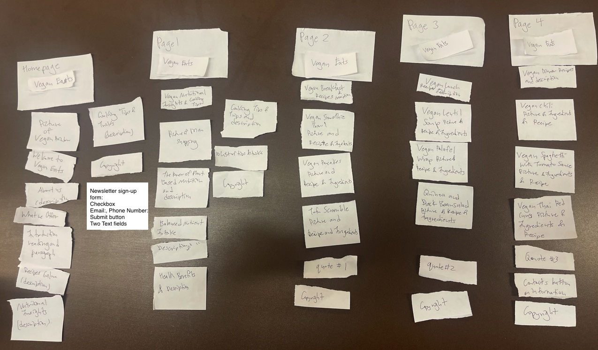
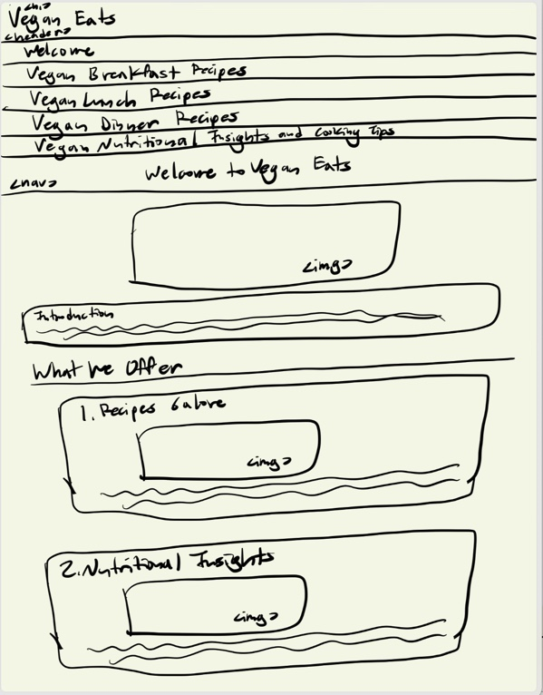
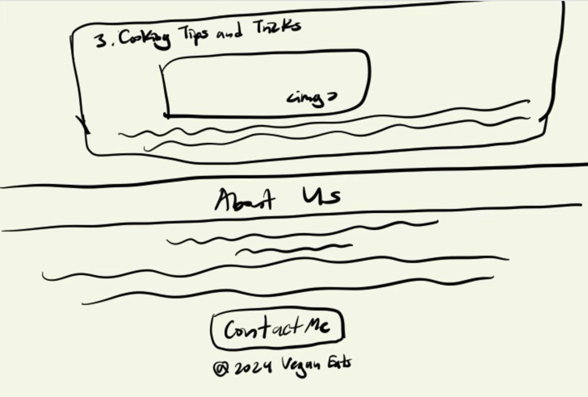
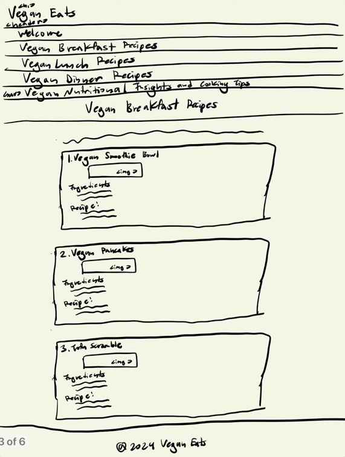
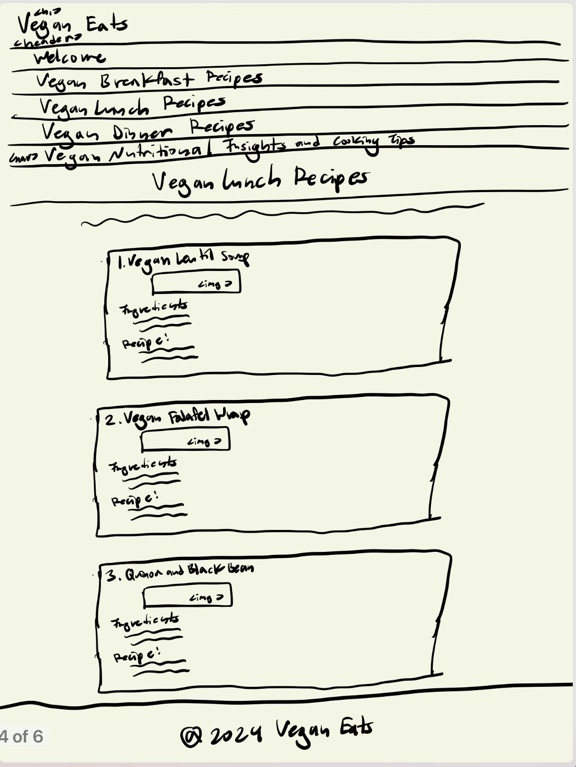
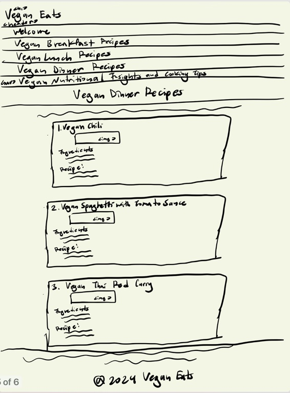
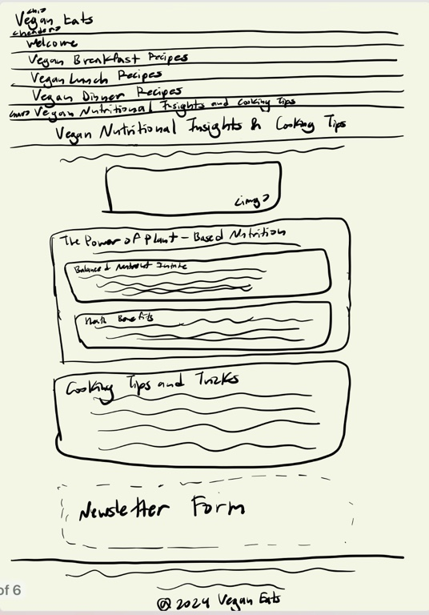

# Project 1, Milestone 2: Design Journey

[← Table of Contents](design-journey.md)

**Replace ALL _TODOs_ with your work.** (There should be no TODOs in the final submission.)

Be clear and concise in your writing. Bullets points are encouraged.

Place all design journey images inside the "design-plan" folder and then link them in Markdown so that they are visible in Markdown Preview.

**Everything, including images, must be visible in _Markdown: Open Preview_.** If it's not visible in the Markdown preview, then we can't grade it. We also can't give you partial credit either. **Please make sure your design journey should is easy to read for the grader;** in Markdown preview the question _and_ answer should have a blank line between them.

## Milestone 1 Feedback Revisions
> Explain what you revised in response to the Milestone 1 feedback (1-3 sentences)

I got points off because my web pages did not validate using the **W3c Online** validation method. So, I used the validation method again this time to spot my errors and discovered it was because I had a space in between my image file names so I changed the names of my image files and their respective src names by replacing any spaces with dashes and replacing any uppsercase letters with lowercase for appropriate name styling.

## Refined Design

### Refined Design: Persona
> Use the goals you identified and your prior user research to develop a persona of your site's audience.
> Your persona must have a name and a face. The face can be a photo of a face or a drawing, etc.
> You may type out the persona below with bullet points or include an image of the persona. Just make sure it's easy to read the persona when previewing markdown.

My persona for my site's audience is a 21 year old female Cornell University student named Anna Lee from Long Island who has recently converted to veganism and wants to learn more about vegan recipes, its health benefits, and become educated on veganism overall.
-Anna Lee
-21 years old
-Female Cornell University student
-From Long Island

.jpg)

Source: <https://vegnews.com/vegan-health-wellness/vegan-asians-pacific-islanders-instagram>

### Refined Design: Narrow or Wide
> Will your refined design be functional on narrow or wide device? (a few words)

My refined design will be functional on a narrow device.

### Refined Design: Form Brainstorm
> Brainstorm ideas for collecting data from your persona on your website.
> The form must support the persona's goals when using the website.
> For each form idea, explain how the form supports the goals of the persona. (1 sentence per idea)
> **Refer to the persona by name.**

1. Newsletter Signup Form: It would include a checkbox with fields and a submit button for Anna Lee to input her email and/or her phone number and this supports Anna Lee's goal of staying updated with new recipes and information about veganism.

2. Recipe Inquiry Form: It would include fields  for Anna Lee to ask specific questions about recipes or request certain types of recipes and this supports Anna Lee's goal of learning more about vegan recipes.

3. Account Signup Form: It would include text fields for Anna Lee to create an account, allowing her to save favorite recipes and personalize her experience and this supports Anna Lee's goal of having a personalized experience on the website.
4.
### Refined Design: Content
> List **all** the content you plan to include your website for your **persona**.
> You should list all types of content you planned to include (i.e. text, photos, images, etc.)
> List the content here. Label the content as "(new)" if it's new to the existing site.
> **Do not include the content here, just provide a list summarizing the content.**

- Vegan Eats (Title)
- Different headings for each webpage
- Picture of vegan rainbow
- Introduction heading and paragraph
- What we Offer subheading
- Recipes Galore and description paragraph
- Nutritional Insights and decription paragraph
- Cooking tips and Tricks and description paragraph
- Picture of peopl's hands eatin vegan food
- Picture of diverse group of happy people
- Picture cook
- Quote #1
- Quote #2
- Quote #3
- About Us description
- Vegan Breakfast recipes heading
- Vegan Smoothie Bowl picture and ingredients and recipe
- Vegan Pancakes picture and ingredients and recipe
- Tofu Scramble picture and ingredients and recipe
- Vegan Lunch recipes heading
- Vegan Smoothie Bowl picture and ingredients and recipe
- Vegan Pancakes picture and ingredients and recipe
- Tofu Scramble picture and ingredients and recipe
- Vegan Dinner recipes heading
- Vegan Chili picture and ingredients and recipe
- Vegan Spaghetti with Tomato Sauce picture and ingredients and recipe
- Vegan Thai Red Curry picture and ingredients and recipe
- Vegan Nutritional Insights & Cooking Tips heading
- Picture of man shopping
- The Power of Plant-Based Nutrition heading and description
- Balanced nutrient intake description
- Health Benefits description
- Cooking Tips and Tricks heading and description
- 10 tips and tricks
- Vegan Eats copyright (new)
- Newsletter sign-up form (new)
  - checkbox (for inputting the user's email, phone number or both)
  - submit button
  - two text fields (one for the user's email and one for the user's phone number)

### Refined Design: Content Justification
> Explain why this content supports the goals of your persona. (1-2 sentences)
> **Refer to the persona by name.**

The content included in the refined design supports Anna Lee's goals by providing a comprehensive and visually appealing platform for her to explore diverse vegan recipes, gain nutritional insights, and acquire cooking tips. The inclusion of the newsletter sign-up form also aligns with Anna Lee's desire to stay updated with new recipes and information about veganism, enhancing her overall experience on the website.

### Refined Design: Content Organization
> Organize the content for the audience and identify possible pages for the content using **several iterations** of card sorting.
> Include photographic evidence of each iteration of card sorting **and** an explanation of your thought process for each iteration. (1 sentence per iteration)
> **Please physically sort cards;** please don't try and do this digitally.
> **Refer to the persona by name.**

For this iteration, I grouped all the breakfast, lunch, and dinner related content together each in a separate page and put the three pages sandwiched in the middle of my homepage and last page, as I wanted to welcome Anna in the homepage with content that summarizes the information of the whole website, catches her attention, and gives her an idea of what the website is about. Putting them next to each other sandwiched with similar content provides consistency and I put my vegan nutritional insights and cooking tips and related information and the newsletter form as my last page as I wanted to put the hefty wordy information for last and I put the newsletter form at the end so that Anna can decide for herself whether she would want to sign up or not

From the first card sorting, I moved the contact button to the last page as I though that maybe it would distract and disengage Anna from the rest of the websiote  by putting it in the homepage (beginning of the site). I put all the quotes and the form on the homepage as I thought if Anna saw the quotes and the newsletter right away, she will be more inspired and encouraged to sign up for more information just in case she loses interest later in the website. I also moved vegan rainbow picture to the middle of the site as I though that the consistency of the site might get boring so I wanted to catch her attention in the middle of the website with the picture.

From the second car sorting, I moved the last page content to be second page as I thought that maybe Anna would want to learn about the benefits and cooking tips and tricks first before diving into the recipes. I distributed one quote each to each recipe to even out the recipe webpages and moved back vegan rainbow picture to homepage for the welcoming aspect.

### Refined Design: Navigation
> Please list the pages you will include in your website's navigation.

- Welcome (index)
- Vegan Breakfast Recipes (page1)
- Vegan Lunch Recipes (page2)
- Vegan Dinner Recipes (page3)
- Vegan Nutritional Insights & Cooking Tips(page4)

> Explain why the names of these pages make sense for your persona. (1 sentence)

The names of the pages make sense for the audience, particularly Anna Lee, as they align with her goals and interests in exploring a variety of vegan recipes throughout the day; the categorization allows Anna Lee to easily navigate the site and find recipes suitable for different meals, supporting her journey into veganism and desire to discover diverse plant-based options.

### Refined Design: Design
> Refine the design of your site to address the goals of your persona.
> Include iterations of **sketches** for each page of the refined design.
> Provide a brief explanation _underneath_ each sketch. (1 sentence per sketch)
> **Refer to your persona by name in each explanation.**

The Homepage welcomes Anna with a bright vegan rainbow picture and gives her a summary of all the information she can look forward to in the website, as Anna wants to learn more about veganism overall this homepage will persuade her that this website will be able to educate her about many different aspects of veganism. The about us and contact modal, including the pictures of people smiling will give Anna a good first impression of the website and will convince her about the website's reliability and give her a a source for any inquiries about the website.

The second page addreses Anna's goal to learn more about recipes by giving a very organized, ordered and list of vegan breakfast recipes and their respective ingredients, along with alluring pictures of the dishes. I added the copyright symbol and a footer on this page in order to give an air of professionalism which will allow Anna to further trust this site and will eliminate any doubts of the website's validity.

The third page also addreses Anna's goal to learn more about recipes by giving a very organized, ordered and list of vegan lunch recipes and their respective ingredients, along with alluringc pictures of the dishes. I also added the copyright symbol and a footer on this page in order to give an air of professionalism which will allow Anna to further trust this site and will eliminate any doubts of the website's validity. Adding it to the third page also shows consistency and is a common theme in most trusted websites.

The fourth page also addreses Anna's goal to learn more about recipes by giving a very organized, ordered and list of vegan lunch recipes and their respective ingredients, along with alluringc pictures of the dishes. There is an inspiring quote in order to break the monotony of the recipe themed pages and will stimulate Anna's positive emotions.

The fifth page concludes the website with the lists of health benefits and nutritional facts (vitamins) about veganism, which satifies Anna's goal on learning more about the health benefits of veganism and veganism overall. Additionally, the cooking tips and tricks is a final takeaway and will help Anna to educate herself on how to better recreate the recipes that she learned from the website. Finally, the newsletter form will assist Anna in being continually educated on veganism and will help her stay connected to the community.

### Partial Plan
> Using your refined sketches, plan your site's partials.
> You may describe each partial or sketch it. It's up to you!
> Explain how you will customize at least 1 partial. (1 sentence)

For my first partial, I will use the <head> tag which contains the title and the setup and css links for the website. I will name the file meta.php and use PHP's include() to replace the old code on each page of my website. I will also use a partial for the <header> tag and use PHP's include() to replace the old code on each page of my website. I will customize this partial by assigning each webpage to a $page_title variable and I will create a CSS class called active_page in order to code php that will underline the title of each of my page in the nav bar depending on the current page the user is on.

[← Table of Contents](design-journey.md)

Only need to design a form for the homepage (you have to redesign homepage since it has the form like add pictures and move stuff around so that the form fits well)
Only need to design the form (do not need to implement the form or comfirmation message) (only need to implement the partials)
newletter ()
inquiring about recipes,
signing up with email to receive more information emails about updates to the website.
