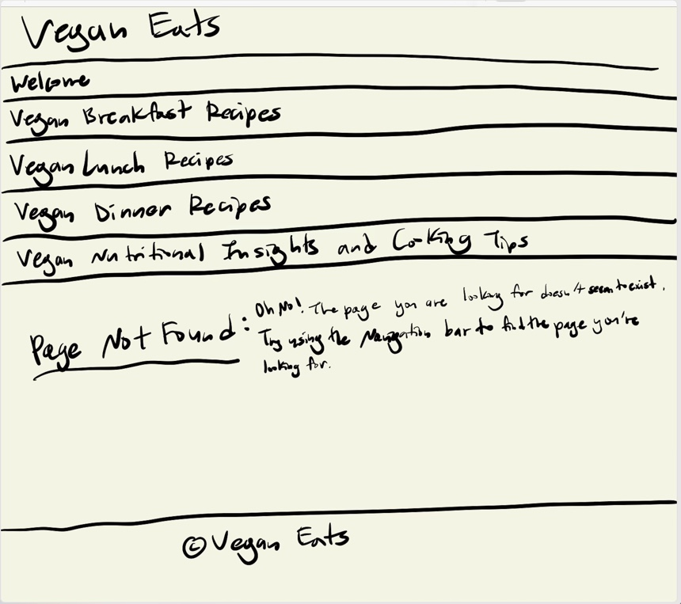
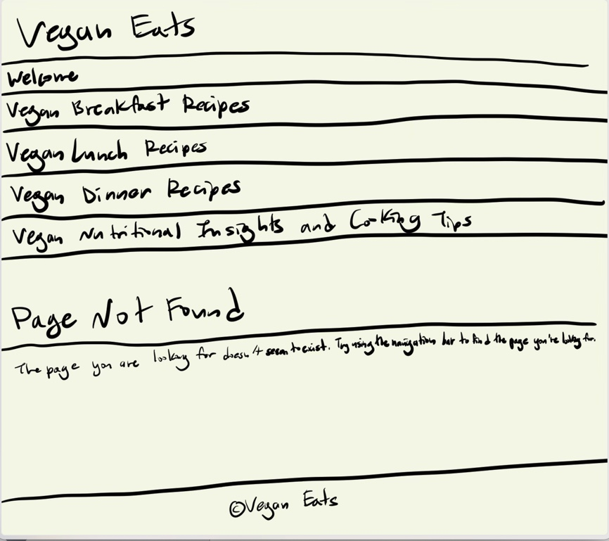

# Project 1, Final Submission: Design Journey

[← Table of Contents](design-journey.md)

**Replace ALL _TODOs_ with your work.** (There should be no TODOs in the final submission.)

Be clear and concise in your writing. Bullets points are encouraged.

Place all design journey images inside the "design-plan" folder and then link them in Markdown so that they are visible in Markdown Preview.

**Everything, including images, must be visible in _Markdown: Open Preview_.** If it's not visible in the Markdown preview, then we can't grade it. We also can't give you partial credit either. **Please make sure your design journey should is easy to read for the grader;** in Markdown preview the question _and_ answer should have a blank line between them.

## Milestone 3 Feedback Revisions
> Explain what you revised in response to the Milestone 3 feedback (1-3 sentences)
> If you didn't make any revisions, explain why.

I did not make any revisions because I did not lose any points and I also did not receive any feedback to make changes.

## URL Design
> Plan your HTTP routing.
> List each route and the PHP file for each route.

| Route                                               | PHP File                            |
| -----------                                         | ----------------------------------- |
| /                                                   | pages/index.php                     |
| /breakfast-recipes                                  | pages/page2.php                     |
| /lunch-recipes                                      | pages/page3.php                     |
| /dinner-recipes                                     | pages/page4.php                     |
| /additional-information                             | pages/page5.php                     |
| /additional-information/confirmation                | pages/page5-confirmation.php        |

> Explain why these routes (URLs) are usable for your persona. (1 sentence)

These routes are memorable and descrtiptive of the content of the site whilst being as concise as they can ve, which fulfills Anna's goals of wanting to learn more about recipes and overall information about veganism, the words are separated by hyphens and not spaces and/or underscores, these routes (URLs) are typable and there are no special characters, and they are all lowercase.

## Missing Resource / Not Found Page
> Refine the design of your site's missing resource 404 page for your persona.
> Include iterations of **sketches** of the page.
> Provide a brief explanation _underneath_ each sketch. (1 sentence)
> **Refer to the persona by name.**

I wanted to differentiate this sketch and create variety from the other pages by doing flexboxes and putting the message next to the "Page Not Found" title, and this adheres to my audience's, Anna's, needs as she does not know anything about coding or URLs so the messages explains in simple English how to renavigate away from the Not Found page and how and why she got there. Also, "Oh No!" provides a sense of friendliness and familiarity which may come off as less formal and rude and encourage Anna to stay on the website.

I wanted to keep consistency across the website so I put the message under the "Page Not Found" header and I provided an explanation that adhere's to Anna's needs as she does not know anything about coding or URLs so the messages explains in simple English how to renavigate away from the Not Found page and how and why she got there. However, I am more formal and do not include "Oh No!" as I wanted to convey to Anna that this website is not a joke and is serious and was created by an educated person who does not take veganism as a joke and takes it seriously.

## Self-Reflection
> Take some time here to reflect on how much you've learned since you started this class. It's often easy to ignore our own progress. Take a moment and think about your accomplishments in this class. Hopefully you'll recognize that you've accomplished a lot and that you should be very proud of those accomplishments! (2-4 sentences)

Throughout this course, I've embarked on a transformative journey, mastering PHP to build dynamic forms and confirmation pages that enhance user interaction. The concept of partials, once foreign, is now a cornerstone of my development process, streamlining my workflow and ensuring consistency across my projects. Routing, a critical aspect of web navigation, has become second nature, enabling me to effectively manage user experiences, including the adept handling of 404 Not Found errors. Moreover, my design skills have evolved to focus keenly on the audience, crafting experiences that resonate deeply with specific personas. This holistic growth in both technical prowess and design sensibility marks a significant milestone in my development journey.

## Grading

### Grading: Mobile or Desktop
> When we grade your final site, should we grade this with a narrow or wide screen?

This website should be graded with a wide screen.

### Collaborators
> List any persons you collaborated with on this project.

I did not collaborate with any persons on this project.

### Reference Resources
> Please cite any external resources you referenced in the creation of your project.
> (i.e. W3Schools, StackOverflow, Mozilla, etc.)

N/A

[← Table of Contents](design-journey.md)
